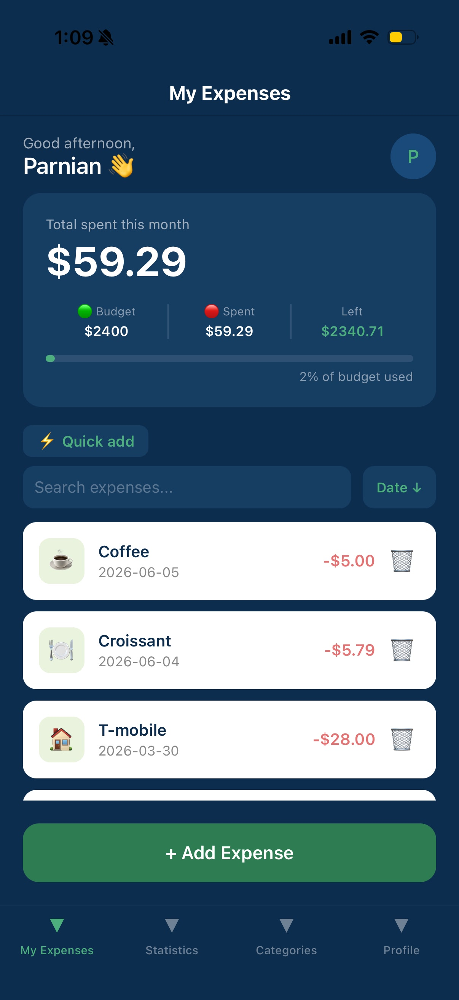
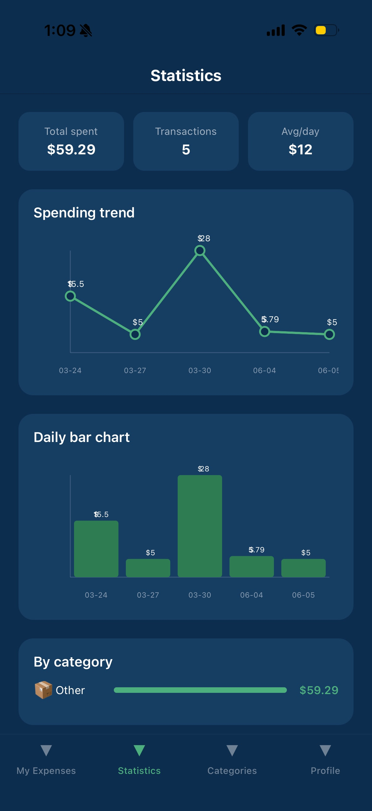
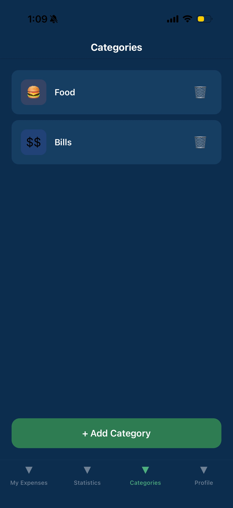
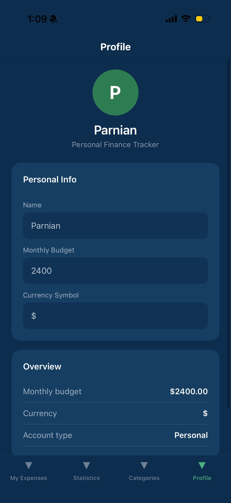

# Expense Tracker

A full-stack mobile and web expense tracking app built with React Native, FastAPI, and Supabase.

## Screenshots

  
  
  
  

## Tech Stack

**Backend:** Python, FastAPI, Supabase (PostgreSQL)  
**Frontend:** React Native, Expo, TypeScript

## Features

- Add, view, and delete expenses and categories
- Budget tracker with progress bar
- Spending charts (line and bar)
- Quick add shortcuts
- Search and sort transactions
- Category management with emoji icons
- Profile screen with editable settings
- Runs on iOS and web from a single codebase

## Project Structure

    expense-tracker/
    ├── backend/
    │   ├── main.py
    │   └── routers/
    └── frontend/
        ├── screens/
        └── services/

## Setup

### Backend
    cd backend
    python3 -m venv env
    source env/bin/activate
    pip install -r requirements.txt
    uvicorn main:app --reload

### Frontend
    cd frontend
    npm install
    npx expo start